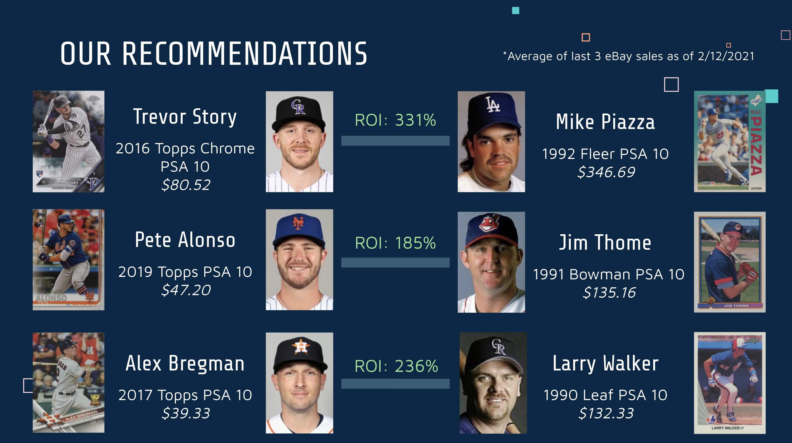

# Identifying Undervalued Baseball Cards in a Booming Market

Author: Hogan Byun

## Project Overview

A popular sports betting site is interested in capitalizing on the recent sports card boom and wants to implement a paid tool to provide sports card investment advice. While hot prospects/rookies have been the hottest part of the market, recently legends and Hall-of-Famers have also seen increases in card prices. This provides an excellent investment opportunity in the middle group: proven veterans who are on track to make the Hall of Fame. They are interested in a tool that can identify Hall of Fame worthy players to invest and provide advice to clients early. 

**NOTE: This project concerns potential gains only and are not guaranteed. There is always risk of injury/other factors when choosing to invest in sports cards.**

## The Data

All the data has been curated from Baseball-Reference's research tool, Stathead. The following batting statistic tables used are:
- All Hall-of-Famers: https://stathead.com/tiny/O0i63
- All retired All-Star, non-HOFers: https://stathead.com/tiny/4lBX0
- All active All-Stars: https://stathead.com/tiny/QsiK8

The following columns were found in each dataset:
* **Rk** - row number
* **Name** - player first and last name
* **WAR/pos** - Wins Above Replacement for position players. A singular number that represents the number of wins a player adds to a team over a replacement.
* **WAA/pos** - Wins Above Average for position players. A singular number that represents the number of wins a player adds to a team over a league-average player.
* **From** -  year player's career began
* **To** -  year player's career ended
* **Age** -  age of career beginning/end on June 30 of the respective year
* **G** -  number of games player
* **PA** -  plate appearances
* **AB** -  at-bats
* **R** - runs scored
* **H** - hits
* **2B** - doubles
* **3B** - triples
* **HR** - home-runs
* **RBI** - runs batted in
* **BB** - walks
* **IBB** - intentional walks
* **SO** - strikeouts
* **HBP** - times hit by pitch
* **SH** - sacrifice hits (sacrifice bunts)
* **SF** - sacrifice flies
* **GDP** - double plays grounded into
* **SB** - stolen bases
* **CS** - number of times caught stealing
* **BA** - batting average
* **OBP** - on-base percentage
* **SLG** - slugging percentage
* **OPS** - on-base + slugging percentages
* **Pos** - Position (300+ games indicated by * and less than 30 games indicated by /)
* **Tm** - Teams played for

## Methods

This project analyzes MLB statistics to recommend undervalued buys in the sports card market. Several classification methods (Random Forest, XGBoost, SVM, etc.) were utilized and optimized to narrow down to a best-fit model. By predicting career trajectories of current players and comparing them to prices of Hall-of-Famers, we were able to identify some undervalued rookie cards that may spike in the future.

* This project will be following the OSEMN data-science process

## Results

Our initial best model turned out to be the random forest model:

Here, we can see that the model did exceptionally well, with a test accuracy of 96.02%. Precision, recall, and f1-score were all 85% across the board. Here, precision measures how many predicted positives are actual positives, recall measures how many true positives were correctly classified, and f1-score is a balance of the previous two.

While this was initially encouraging, there was one issue with the model that had not been addressed. With this, I want to take a moment to go over some background information on voting in hall of famers. To be eligible,

- The player must have began his career at least 20 years before, and ended his career 5 years before the voting year
- A player is allowed to be on the ballot for at most 10 years. Players who are "obviously" hall of famers will get in on the first year of their eligibility, while players who are probable, but not transcendent, will likely take a few years before getting voted in.

The issue with this model so far is that it labels (1) players who are first-ballot hall of famers but have not gotten in solely because they have not been retired for the 5-year minimum, (2) players who would be first-ballot hall of famers if they retired today, as non-hall-of-famers, and (3) players who have the statistics to get in, but are hindered by other reasons (controversy, steroids, etc.). So while these players have the career stats that would grant them first-ballot hall of fame status, they are not for eligibility reasons. Yet, this model is supposed to predict based on statistics only and having these players labeled as non-hall-of-famers will likely hurt the model.

First-ballot means that the player would be voted into the hall of fame on the first-year of eligibility

So one thing to do that could help with the predictions is to artificially label these players as hall-of-famers. I only included predicted first-ballot hall of famers and not all predicted hall of famers, because they are generally unanimously agreed as hall of fame worthy (I also included Barry Bonds, as his statistics should definitely qualify as HOF, but his steroid controversy has barred that from happening thus far).

First-ballot hall-of-famer predictions will be supplied by: https://www.espn.com/mlb/story/_/id/28516610/predicting-mlb-hall-fame-selections-2020s

This article mentions some players who were implicated for using steroids but should still be included in the hall-of-fame: https://bleacherreport.com/articles/2886512-which-mlb-steroid-users-deserve-to-be-in-the-baseball-hall-of-fame

The players that ended up being classified as HOFers are Derek Jeter, Adrian Beltre, Ichiro Suzuki, Albert Pujols, Miguel Cabrera, David Ortiz, Barry Bonds

After accounting for these players, our best model came out to be an XGBoost model:

Thankfully, we see very similar classification metrics to those of the original model.
Now, taking a look at the most important statistics when classifying HOFers, we see that WAR has a massive lead over any other category, with WAA, BA, and 3B as far seconds. This is encouraging to see as WAR is traditionally a big factor in HOF voting. 

Next, we made loose projections on a player's career using the player's age and current statistics. We took a player's average per-season statistics and added that statline for every season a player had until the average retirement age of 36. Afterwards, we used to the model to predict which player's have HOF trajectories. These were the players:

Mike Trout, Nolan Arenado, Bryce Harper, Manny Machado, Miguel Cabrera, Mookie Betts, Christian Yelich, Francisco Lindor, Trevor Story, Cody Bellinger, Alex Bregman, Matt Chapman, Ronald Acuna Jr., Pete Alonso

From this list, we identified any players with flagship PSA 10 rookie cards under $100, which were, **Trevor Story 2016 Topps Chrome**: $80.52, **Matt Chapman 2017 Topps**: $61.33, **Pete Alonso 2019 Topps**: $47.20, **Alex Bregman 2017 Topps**: $39.33

Afterwards, we found the most similar statistical HOF comparisons for these players to guage where the card can potentially go. To do this, for example, we took Trevor Story's career projections and subtracted that satline form all those of HOFers. Then, we took the absolute value of each difference and calculated the mean. In addition, sine the vintage and modern card markets differ so uch in pricing structure, we took the top-10 most similar HOFers and took the player with the nist recent rookie card. Below is a graphic from our presentation that shows each recommendation. (Note: Matt Chapman was left off as there was no suitable modern comparison).

## Future Work

There are a few tweaks and alternate directions that would be interesting to explore in the future.

1) **Per 162 Game Data**: This project thus far had been done using career statistics. I think it would be valuable to look into a full-season's worth of games (162 games). In other words, this would be looking at what a player averages per 162 games. This would elevate any players who have good per season stats but have not played enough games to warrant amazing career stats. 

2) **Era-based Model**: The game of baseball has changed a lot of time and with that, the statistics of a "good" player has also changed. For example, very early baseball was not a homerun-heavy sport. Frank "Home Run" Baker, who player in the early 1900's and was given that nickname because he hit a lot of home runs, never hit more than 12 in a season. In 2019, 58 players hit 30 or more home runs that season. Including only players after the expansion era (ended 1973) could provide a more accurate measure of what is needed for a player to reach the hall of fame today. The only problem would be lack of data points, but using SMOTE to artificially generate data should do the trick.

3) **Risk Assessment**: These comparisons represent potential price ceilings if a player's career goes as predicted, however, there are always players who do not continue their production or are halted by injuries. Incorporating a way to look at floors if these scenarios were to happen would definitely by useful when deciding to buy these players. 
